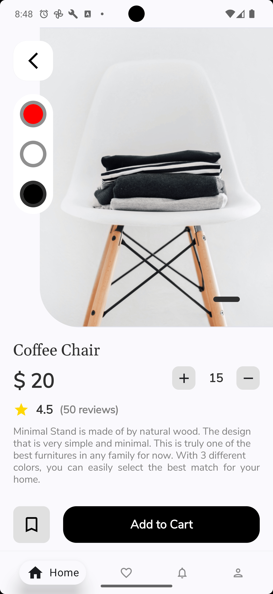

### Still in development

# Furniture Shopping App

The Furniture Shopping App is a furniture shopping application built with Kotlin and Java, using Gradle to manage dependencies.
The application is designed based on: [Figma](https://www.figma.com/design/dTdGEtZoQd2uRZc8qS5xjr/Timberr?node-id=0-1)

## Features

The application provides the following features:

- Secure registration and login
- Browse and search for furniture products.
- Add products to the shopping cart.
- Place orders
- View product details.
- Review notifications, shopping cart, orders,
- Manage personal profile

## Technologies Used

- Programming languages: Kotlin and Java.
- Dependency management: Gradle.
- User interface: Android Jetpack Compose.
- Database: Supabase.

## Database

The application uses Supabase as the database system. Supabase provides a RESTful API for querying data and also supports real-time updates.

## Interface

The application uses Android Jetpack Compose to build the user interface. Jetpack Compose is a modern UI library that helps build user interfaces simply and efficiently.

<details>
<summary><b>Authentication</b></summary>

&nbsp;&nbsp;&nbsp;&nbsp;&nbsp;&nbsp;

</details><br>

## Installation

First, clone this repository to your machine:

```bash
git clone https://github.com/nqmgaming/FurnitureShoppingApp.git
